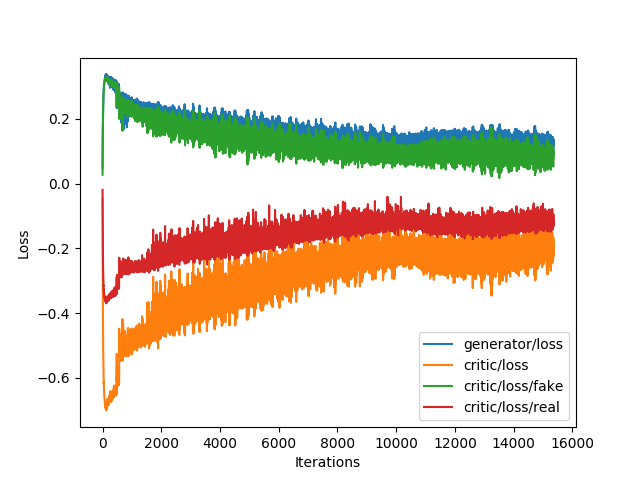

# Wasserstein GAN

Chainer implementation of the Wesserstein GAN by Martin Arjovsky et al. Note that this is not the official implementation. The official implementation is https://github.com/martinarjovsky/WassersteinGAN.

Also, a summary of the paper can be found [here](https://paper.dropbox.com/doc/Wasserstein-GAN-GvU0p2V9ThzdwY3BbhoP7). It explains the intuition behind the approximation of the EM distance and the problem with the Jensen-Shannon divergence.

## Run

Train the models with CIFAR-10. Images will be randomly sampled from the generator after each epoch, and saved under a subdirectory `result/` (which is created automatically).

```bash
python train.py --batch-size 64 --epochs 100 --gpu 1
```

## Sample

Plotting the estimates with CIFAR-10.


